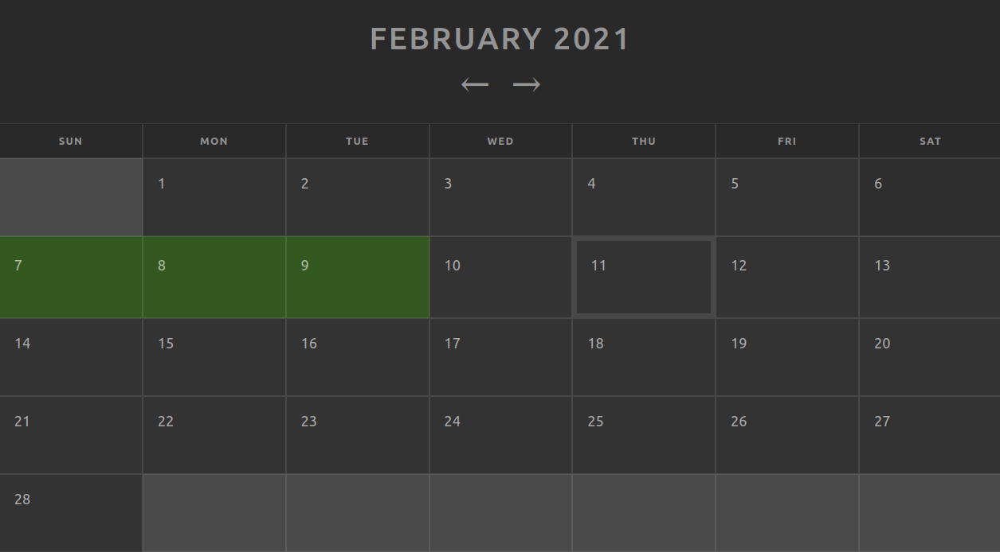

# I wrote today
A minimalist web app for tracking what days of the month you completed a task.

I use it to keep track of what days I worked on my writing, but you could also use it to keep track of what days you read a book, exercised, pet your cat...

See it in action at http://iwrotetoday.sheesania.com! Data is stored in your browser's local storage, so it will stick around as long as you use the same browser to access the website.

## Developing
I Wrote Today is built with React with local storage for its "database". To work on the code, all you'll need to do is check out the repository and run `npm install`, then `npm start` to run a development server. To build a deployable version, run `npm run build`. There are currently no unit tests :(

## Credits
Calendar CSS based on [Kenny Sing's responsive calendar](https://codepen.io/KennySing/pen/rBDlJ).

"[Cat](https://thenounproject.com/search/?q=cat&i=3556313)" icon by Gregor Cresnar from [the Noun Project](https://thenounproject.com/).